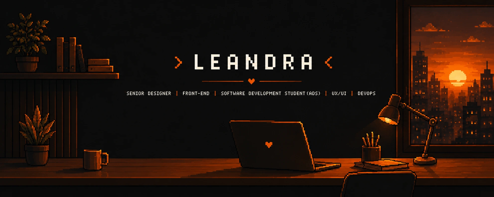

  

<samp>UX/UI Designer and Full-Stack Developer in progress, with 15+ years of experience in visual communication, branding and digital interfaces.</samp>
 
<samp>Graduated in Graphic Design from IFPE, postgraduated in UX Design, currently studying Analysis and Systems Development (ADS), and expanding my knowledge in software development, DevOps and technology.</samp>

<h2 align="left"><samp> About me </samp></h2>

  <samp>
✨ Passionate about learning and continuous improvement  
💻 Expanding into Full-Stack Development with focus on web applications and technology products  
🎯 Passionate about creating accessible, intuitive and meaningful user experiences  
🧠 Strong foundation in visual hierarchy, branding, typography, design systems and UX principles  
🤝 Experience collaborating with multidisciplinary teams and developers  
💡 Combining design thinking, creativity and technology to build clear and functional digital solutions 
  </samp>

###

<h2 align="left"> <samp> Currently learning </samp> </h2>

  <samp>
🚀 JavaScript and React Student  
🚀 Python programming Learning  
🚀 Software Engineering Learning  
🚀 Modern technologies for digital products  
🚀 Programming logic and application development  
🚀 DevOps and modern development workflows 
  </samp>

###

<h2 align="left"><samp> I work with </samp></h2>

###

  
  
  
  
  
  
  
  
  
  
  
  
  
  
  
  
  
  

<!-- 

  

-->

###

 
     

